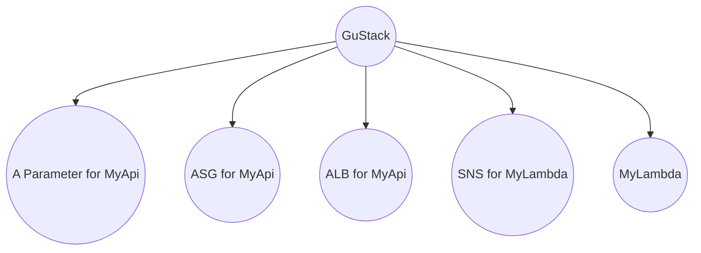
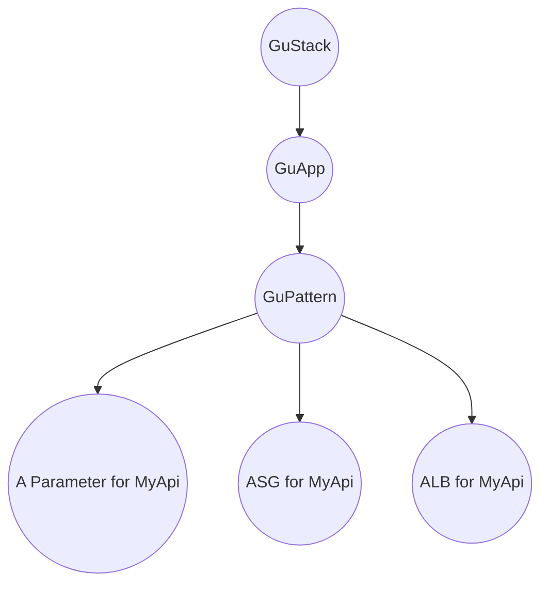

# Component Constructors - Update 1

## Status

<!--- What is the status, such as proposed, accepted, rejected, deprecated, superseded, etc.? -->

proposed

## Context

<!--- What is the issue that we're seeing that is motivating this decision or change? -->

A CDK application has a [construct tree](https://docs.aws.amazon.com/cdk/v2/guide/constructs.html#constructs_tree),
which allows one to clearly describe the relationship between constructs.

We currently place all constructs on a `GuStack`:



Whilst this works, we're unable to see that there are two units:
  - `A Parameter for MyApi`, `ASG for MyApi` and `ALB for MyApi`
  - `SNS for MyLambda` and `MyLambda`

Based on the department's current [conventions](https://github.com/guardian/recommendations/blob/main/AWS.md) we call this unit an App,
and we establish their relation via the `App` tag.

## Positions

<!--- What are the differing positions or proposals on this issue? -->

1. Do not change

2. Introduce construct hierarchy, specifically by changing the type of `scope` in the constructor from `GuStack` to `GuApp`

   This will allow us to group constructs more descriptively:

   ```mermaid
   graph TB
     A((GuStack))-->B((GuApp - MyApi))
      A-->C((GuApp - MyLambda))
      B-->D((A Parameter for MyApi))
      B-->E((ASG for MyApi))
      B-->F((ALB for MyApi))
      C-->G((SNS for MyLambda))
      C-->H((MyLambda))
   ```

## Decision

<!-- What is the change that we're proposing and/or doing? -->

As the ADR title suggests, this is an update to [Component Constructors](002-component-constuctors.md), namely the first decision:

1. The first parameter should be a `scope` of type `GuApp`:

   :white_check_mark: Valid

   ```ts
   class MyConstruct {
     constructor(scope: GuApp) {
       ...
     }
   }
   ```

   :x: Invalid

   ```ts
   class MyConstruct {
     constructor(scope: GuStack) {
       ...
     }
   }
   ```

   Where `GuApp` is a simple [`Construct`](https://docs.aws.amazon.com/cdk/v2/guide/constructs.html). A `GuApp` can then tag all it's children, to meet the recommendations.

   Some constructs need to be shared across constructs, for example a Parameter for the location of the artifact bucket.
   In this scenario, it's desirable for the construct to only exist once in the tree. To achieve this, we'd place them on `GuStack` as a singleton:

   ```ts
   import { isSingletonPresentInStack } from "utils/singleton";

   export class MySingleton extends SomeConstruct {
     private static instance: MySingleton | undefined;

     private constructor(scope: GuStack){
       super(scope, "MySingleton", {
         // the props
       });
     }

     public static getInstance(stack: GuStack): MySingleton {
       if (!this.instance || !isSingletonPresentInStack(stack, this.instance)) {
         this.instance = new MySingleton(stack);
       }

       return this.instance;
     }
   }
   ```

## Consequences

<!-- What becomes easier or more difficult to do because of this change? -->

Having a more descriptive tree of constructs will help improve tracking usage of patterns, as we'd further grow the tree to have a `GuPattern` node:



The `GuPattern` construct can then tag all it's children with the name of the pattern, and now we're able to understand if an ASG was created with the pattern, or manually.
