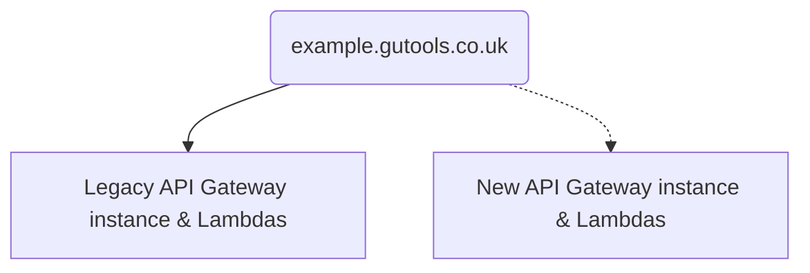
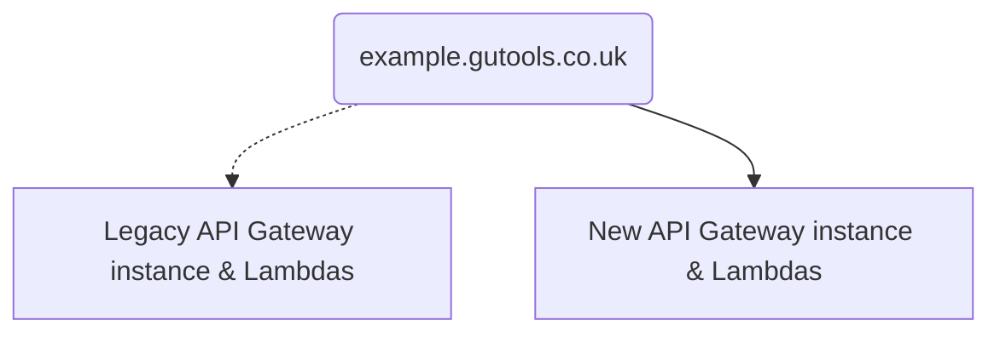
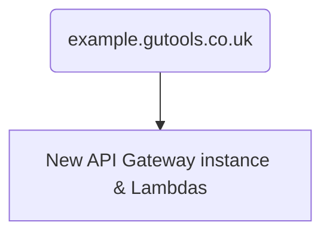

# Migration Guide (GuApiLambda & GuApiGatewayWithLambdaByPath)

This document assumes you have completed initial setup and other steps described
in the [Migration Guide](./migration-guide.md).

---

For apps where avoiding downtime is critical, we recommend a _dual-stack
migration strategy_. The idea is to duplicate the key parts of the stack using
the pattern, test, and, once confident, switch DNS to point to the new stack.

**Stage 1: dual-stack**

**Stage 2: switch DNS**

**Stage 3: cleanup**

## Stage 1: the new stack

_This stage creates a new version of your app's infrastructure, according to
CDK’s best practices. Note that some resources (e.g. Dynamo tables) will not be
duplicated as part of the pattern._

_At the end of this stage, you should have a functional copy of your
application, which can be used for testing purposes. Riff-Raff will have been
configured to deploy to both versions of your infrastructure, so you can operate
in this state for as long as you need to._

1. Identify the correct GuCDK pattern

    If your app serves all requests via a single Lambda function, you will need [`GuApiLambda`](https://guardian.github.io/cdk/classes/patterns.GuApiLambda.html).

    If your app routes different requests to different Lambda functions, you will need [`GuApiGatewayWithLambdaByPath`](https://guardian.github.io/cdk/classes/patterns.GuApiGatewayWithLambdaByPath.html).

2. Create an instance of the pattern

    Use your existing stack as a guide. For example, you will likely need to
    create some custom IAM permissions and add them to your
    [Lambda](https://guardian.github.io/cdk/classes/constructs_lambda.GuLambdaFunction.html).

    There's an example of this [here](https://github.com/guardian/tag-janitor/blob/9e2222d7cea6b37a48e5327efecf7b543b81af15/cdk/lib/cdk-stack.ts#L57-L62).

3. Update your `riff-raff.yaml` to deploy application code to your new Lambda function(s)

    As we will be using a dual-stack migration strategy, we want Riff-Raff to update the application code for old (CFN-defined)
    and new (GuCDK-defined) versions of the Lambda function(s) as part of every deployment.

    There's an example of this [here](https://github.com/guardian/mobile-save-for-later/pull/65/files#diff-f1f55b65ced3f9ca1a6a068f04d6dc6241689cef94fce7c0cb62422495ff4534).

    Note that you **must** use the `functionNames` parameter for this to work.
    The alternative strategy (which uses `lookupByTags`), will not work with the dual-stack approach.

## Stage 2: switch DNS

_This stage routes all traffic to your new (GuCDK-defined) infrastructure, by updating the mapping between your custom
domain name and your API Gateway instance._

_At the end of this stage, all traffic should be running via the new resources that we created in Stage 1.
The equivalent old resources should still be part of your stack, but they should be redundant by the end of this stage._

_These instructions assume that you are using a custom domain name with your API Gateway instance.
If this is the case, you should find a resource of type `AWS::ApiGateway::DomainName` in your CloudFormation template.
If you **do not** have a custom domain name, please contact DevX to discuss alternative migration strategies._

1. Identify the `AWS::ApiGateway::DomainName` and `AWS::ApiGateway::BasePathMapping` resources in your CloudFormation template.

2. Create an instance of the `CfnDomainName` and `CfnBasePathMapping` classes in your template.

    In order to avoid downtime, pass the logical id of your `AWS::ApiGateway::DomainName` into the `CfnDomainName` class and
    the logical id of the `AWS::ApiGateway::BasePathMapping` into your `CfnBasePathMapping` class.

    Ensure that the properties passed into these classes line up with those specified in your CloudFormation template.

    There's an example of this change [here](https://github.com/guardian/mobile-save-for-later/pull/66/files).

    For more information on safely incorporating these stateful resources, see [these docs](./stateful-resources.md).

3. At this stage, create a CloudFormation change set and confirm that no resources are identified for replacement.

4. Deploy this change to your `CODE` environment using Riff-Raff and confirm that resources are not replaced and that your
API still works as expected.

5. Raise a PR and merge it (once approved).

    It's helpful to ship a PR at this point as it allows us to rollback easily if something goes wrong after migrating the DNS.

6. Modify your `CfnBasePathMapping` class to point at your new API Gateway Instance and your API Gateway Stage.

    There's an example of this [here](https://github.com/guardian/mobile-save-for-later/pull/67).

## Stage 3: cleanup

_This stage removes all redundant resources from your original template._

_At the end of this stage, the vast majority of your resources will be created
via the CDK pattern. Some resources, such as Dynamo tables, may still be defined
in your original CFN template._

1. View request count metrics for old vs new API Gateway instances in CloudWatch.

   You should not proceed until you have confirmed that the old API Gateway instance is
   receiving 0 requests.

2. Identify redundant resources in your original CFN template.

   For example, all API Gateway resources, Lambda functions, previous alarms, etc.

3. Remove the redundant resources from your original CFN template.

   In simple cases it may be possible to remove the whole file. If so, you
   should also be able to remove the `CfnInclude` block.

4. Remove the old function names from your `riff-raff.yaml`

5. Deploy this change manually using Riff-Raff.

    Note that you will need to deploy this change manually in order to bypass Riff-Raff's built-in safety mechanisms.
    In order to avoid the accidental deletion of resources, Riff-Raff will not delete certain AWS resources (e.g. API
    Gateway instances) by default. To instruct Riff-Raff to do this, select `Advanced settings` and choose `Dangerous`
    from the `Update strategy` dropdown.

6. After the deployment has finished, confirm that your app still works as expected.
