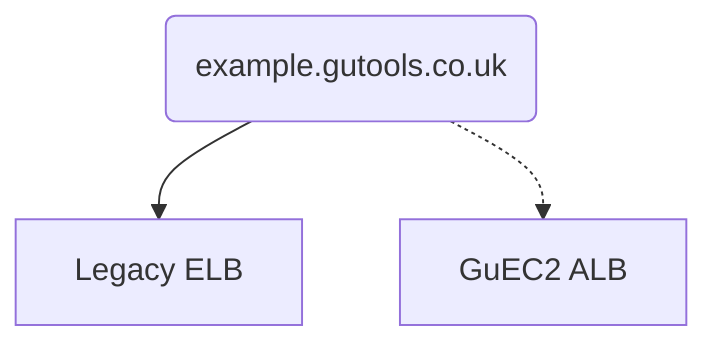
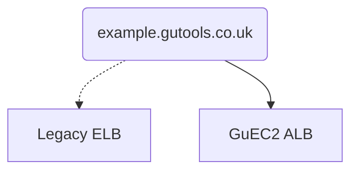
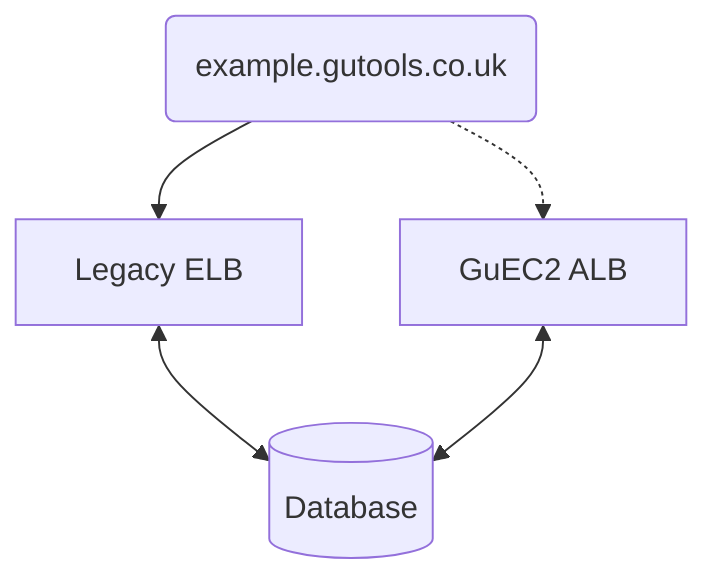

# Migration Guide (GuEc2App)

This document assumes you have completed initial setup and other steps described
in the [Migration Guide](./migration-guide.md).

---

The [GuEc2App](https://guardian.github.io/cdk/classes/index.GuEc2App.html)
pattern describes a web service with instances running in an auto-scaling group
(ASG), accessed via an Application Load Balancer (ALB).

It is an appropriate CDK target for many Guardian web services.

However, migrating running applications is not always straightforward. For
example, the app may use an ELB whereas the pattern uses an ALB.

For apps where avoiding downtime is critical, we recommend a _dual-stack
migration strategy_. The idea is to duplicate the key parts of the stack using
the pattern, test, and, once confident, switch DNS to point to the new stack.

**Stage 1: dual-stack**



**Stage 2: switch DNS**



**Stage 3: cleanup**

```mermaid
graph TDp
    A(example.gutools.co.uk)
    A --> C[GuEC2 ALB]
```

If you application includes a database, queues, S3 buckets, etc., you can either
duplicate these two, or share them across the two instance groups. E.g. for the
latter, something like:



And the continue to migrate DNS and cleanup as described above.

There is no single-best solution here though; some applications may not work
with this approach.

## Stage 1: the new stack

_This stage creates a new version of your EC2 app’s infrastructure, according to
CDK’s best practices. For example, if you are currently using an ELB (old AWS
resource type), the new version of your infrastructure will use an ALB (new AWS
resource type). Note that some resources (e.g. Dynamo tables) will not be
duplicated as part of the pattern._

_At the end of this stage, you should have a functional copy of your
application, which can be used for testing purposes. Riff-Raff will have been
configured to deploy to both versions of your infrastructure, so you can operate
in this state for as long as you need to._

_We will remove the old copy of your resources in a later stage of the
migration._

1.  Create an instance of GuEc2App in your stack.

    Use your existing stack as a guide. For example, you will likely need to
    create some custom IAM permissions and pass them into the pattern.

2.  Add a tag with the name gu:riffraff:new-asg and value true to your new ASG.

    There’s an example of this here.

3.  Update your riff-raff.yaml file to include the `asgMigrationInProgress` parameter.

    There’s an example of this here.

4.  Manually apply the CloudFormation update via the console.

    a. Ensure that the latest version of main has been deployed to CODE/PROD
    before making further changes

    b. Populate the AMI<App> CloudFormation parameter with the AMI ID that is
    currently being used for your application

    c. Preview the change set: it should only contain Add operations, as we are
    just provisioning new resources here.

5.  Deploy this change using Riff-Raff and confirm that both ASGs are updated
    as part of the deployment.

6.  Test your app’s functionality via the new load balancer’s DNS name (this can
    be found as an output in the CFN console).

## Stage 2: switch DNS

_This stage ensures that you are able to manage your own DNS record(s) via CDK and updates your DNS record(s) to point at your new load balancer(s)._

_At the end of this stage, all traffic should be running via the new resources that we created in Stage 2. The equivalent old resources should still be part of your stack, but they should be redundant by the end of this stage._

_The instructions here assume that your DNS record is managed via NS1. To check if you are using NS1, you can use dig - dig +nssearch +noall +answer <TLD> where TLD is the top level domain. For example dig +nssearch +noall +answer gutools.co.uk._

1.  Start managing your DNS record via CDK by instantiating a GuCname construct

    Use dig to check the current properties of your DNS record, for example:
    `dig CNAME security-hq.gutools.co.uk`.

    Instantiate the GuCname class, ensuring that all properties match the
    properties in NS1. The CNAME should still point at your old load balancer’s
    DNS name for now.

    Here is an example of this change.

    _N.B. if your template already includes a Guardian::DNS::RecordSet resource,
    you will need to:_

    - _Use the same logical id when instantiating the GuCname via CloudFormation_
    - _Delete the Guardian::DNS::RecordSet resource in the same PR that the
      GuCname is added_

2.  Drop the TTL for your DNS record, to enable faster rollback if something goes wrong.

    Wait for the TTL to expire before proceeding. Here is an example of this
    change.

3.  Update DNS entry for your so that it points to the new load balancer.

    Here is an example of this change.

4.  Run some tests to confirm that functionality still works as expected.

5.  Wait for a while before proceeding with Stage 6.

    If something goes wrong at this point, we can still roll back by reverting
    the DNS change.

6.  Once you are confident that the new infrastructure is working correctly, increase the TTL for your DNS record again.

## Stage 3: cleanup

_This stage removes all redundant resources from your original template._

_At the end of this stage, the vast majority of your resources will be created
via the CDK pattern. Some resources, such as Dynamo tables, may still be defined
in your original CFN template._

1. View request count metrics for old vs new load balancers in CloudWatch.

   You should not proceed until you have confirmed that the old load balancer is
   receiving 0 requests.

2. Identify redundant resources in your original CFN template.

   For example, ASGs, LoadBalancers, previous alarms, etc.

3. Remove the redundant resources from your original CFN template.

   In simple cases it may be possible to remove the whole file. If so, you
   should also be able to remove the CfnInclude block and the associated
   dependency

4. Remove the gu:riffraff:new-asg tag from your new ASG.

5. Remove the `asgMigrationInProgress` parameter from your riff-raff.yaml.

6. Update your riff-raff.yaml to use the correct `amiParameter` (this will be AMI<Appname>)

7. Preview the CloudFormation update (via ./script/diff)

   It should largely comprise of resource removals. It should also modify the
   new ASG (due to the tag removal)

8. Apply the CloudFormation update manually.

9. Deploy this change using Riff-Raff.

   In CODE you should test this by deploying your branch. In PROD you can merge
   the PR and allow Riff-Raff to deploy main automatically

10. Confirm that your app still works as expected.
